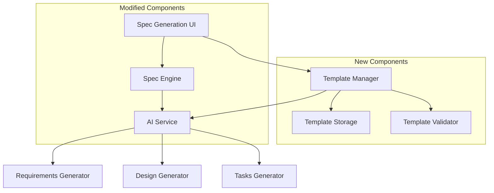

# Design Document

## Overview

This design implements a coding template system that integrates with the existing spec generation workflow. The solution adds a template input interface to the spec generation screen and modifies the AI service prompts to incorporate user-defined coding standards and patterns throughout all phases of specification generation.

## Architecture

The coding template feature extends the existing OpenFlux architecture with minimal changes:



## Components and Interfaces

### Template Manager
- **Purpose**: Manages template CRUD operations and validation
- **Location**: `services/template_service.py`
- **Key Methods**:
  - `save_template(name: str, content: str) -> bool`
  - `load_template(name: str) -> str`
  - `list_templates() -> List[Dict]`
  - `delete_template(name: str) -> bool`
  - `validate_template(content: str) -> Dict`

### Template Storage
- **Purpose**: Persistent storage for coding templates
- **Location**: `.openflux/templates/` directory
- **Format**: JSON files with template metadata and content
- **Schema**:
```json
{
  "name": "template_name",
  "content": "template_content",
  "created_at": "timestamp",
  "updated_at": "timestamp"
}
```

### Template Validator
- **Purpose**: Validates template content and provides feedback
- **Integration**: Part of Template Manager
- **Validation Rules**:
  - Minimum 50 characters
  - Contains meaningful coding guidance
  - Proper formatting for AI consumption

### Modified Spec Engine
- **Changes**: Enhanced prompt generation to include template context
- **New Method**: `incorporate_template(prompt: str, template: str) -> str`
- **Integration Points**:
  - Requirements generation
  - Design generation  
  - Task generation

### Enhanced UI Components
- **Template Input Field**: Multi-line text area with validation
- **Template Selector**: Dropdown for saved templates
- **Template Actions**: Save, load, delete, preview buttons
- **Validation Display**: Real-time feedback and error messages

## Data Models

### Template Model
```python
@dataclass
class CodingTemplate:
    name: str
    content: str
    created_at: datetime
    updated_at: datetime
    
    def validate(self) -> Dict[str, Any]:
        """Validate template content and return validation results"""
        
    def to_dict(self) -> Dict:
        """Convert to dictionary for JSON serialization"""
        
    @classmethod
    def from_dict(cls, data: Dict) -> 'CodingTemplate':
        """Create instance from dictionary"""
```

### Template Validation Result
```python
@dataclass
class ValidationResult:
    is_valid: bool
    character_count: int
    issues: List[str]
    suggestions: List[str]
    score: int  # 0-100 quality score
```

## Error Handling

### Template Storage Errors
- **File System Issues**: Graceful fallback to session-only storage
- **Permission Errors**: Clear user messaging with alternative solutions
- **Corruption**: Template recovery and backup mechanisms

### Validation Errors
- **Invalid Content**: Specific feedback on what needs improvement
- **Format Issues**: Suggestions for proper template structure
- **Length Issues**: Clear guidance on minimum requirements

### AI Integration Errors
- **Template Processing**: Fallback to default prompts if template integration fails
- **Prompt Length**: Template truncation if combined prompt exceeds limits
- **Context Overflow**: Intelligent template summarization

## Testing Strategy

### Unit Tests
- Template validation logic
- Storage operations (save, load, delete)
- Prompt integration functionality
- UI component behavior

### Integration Tests
- End-to-end spec generation with templates
- Template persistence across sessions
- AI service integration with template context
- Error handling scenarios

### User Acceptance Tests
- Template creation and management workflow
- Spec generation quality with templates
- Template reuse across multiple specs
- Performance with large templates

## Security Considerations

### Template Content Security
- **Input Sanitization**: Prevent injection attacks in template content
- **Content Validation**: Ensure templates don't contain malicious prompts
- **Size Limits**: Prevent excessive template sizes that could cause DoS

### Storage Security
- **File Permissions**: Restrict template file access to application only
- **Path Validation**: Prevent directory traversal attacks
- **Backup Security**: Secure handling of template backups

## Performance Considerations

### Template Processing
- **Caching**: Cache frequently used templates in memory
- **Lazy Loading**: Load templates only when needed
- **Compression**: Compress large templates for storage efficiency

### AI Integration
- **Prompt Optimization**: Efficient template integration without bloating prompts
- **Context Management**: Smart truncation of template content when needed
- **Response Caching**: Cache AI responses for identical template+requirement combinations

### UI Performance
- **Debounced Validation**: Avoid excessive validation calls during typing
- **Progressive Loading**: Load template list progressively for large collections
- **Memory Management**: Efficient handling of template content in browser

## Implementation Phases

### Phase 1: Core Template Management
- Template storage and retrieval
- Basic validation functionality
- Simple UI integration

### Phase 2: AI Integration
- Prompt enhancement with template context
- Template-aware spec generation
- Error handling and fallbacks

### Phase 3: Advanced Features
- Template saving and management
- Preview functionality
- Performance optimizations

### Phase 4: Polish and Testing
- Comprehensive testing
- UI/UX improvements
- Documentation and help text